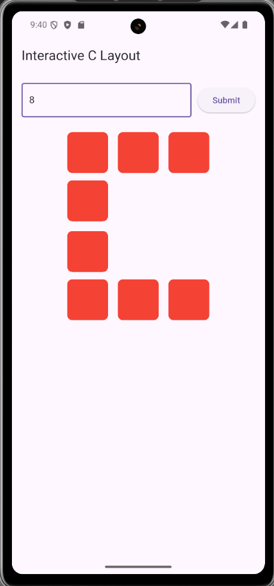
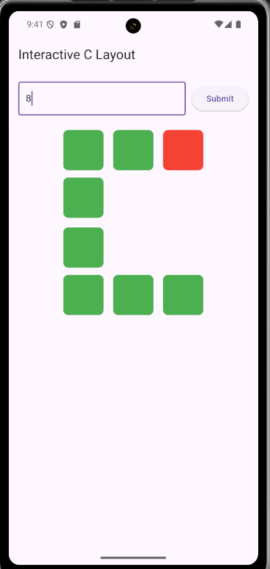

# interactive_box

## Overview
Interactive Box – Flutter Project
A Flutter application that dynamically displays colored boxes in the shape of the letter ‘C’.
Users can input a number to generate boxes, tap to toggle colors, and see an animated reset when all boxes turn green.

## Features
- User input to specify number of boxes (5–25)
- Dynamic 'C'-shaped layout based on the input
- Tap interaction (Red → Green)
- Auto-reset animation (Green → Red in reverse tap order)
- Responsive UI with smooth transitions
- Clean MVVM architecture using Cubit (BLoC)

## Flutter Version
- 3.29.3
- State Management: flutter_bloc

## Logics
- Input Handling
User enters a number N (must be between 5 and 25).
Input is validated, and boxes are generated accordingly.
- Layout Generation
Boxes are split into 3 parts using splitCLayout():
Top Row
Left Column
Bottom Row
- Box States
All boxes start red (false).
When a user taps a box, it turns green and its index is stored in tapOrder.
- Auto Reset Animation
When all boxes turn green, they automatically reset to red, one per second, in reverse tap order using Future.delayed().
- Responsive UI
Wrap + MediaQuery used for dynamic sizing to prevent overflow on smaller screens.
AnimatedContainer ensures smooth color transitions.

##  Steps to Run the Project
 1. Clone the repository
 2. flutter pub get 
 3. flutter run

## Output Preview

